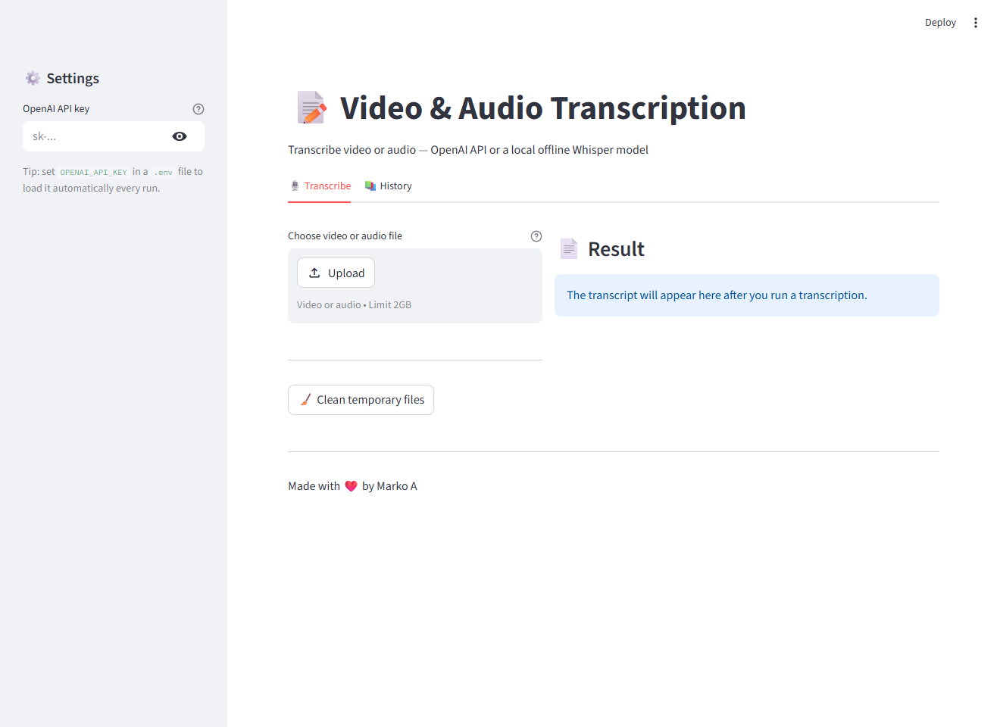
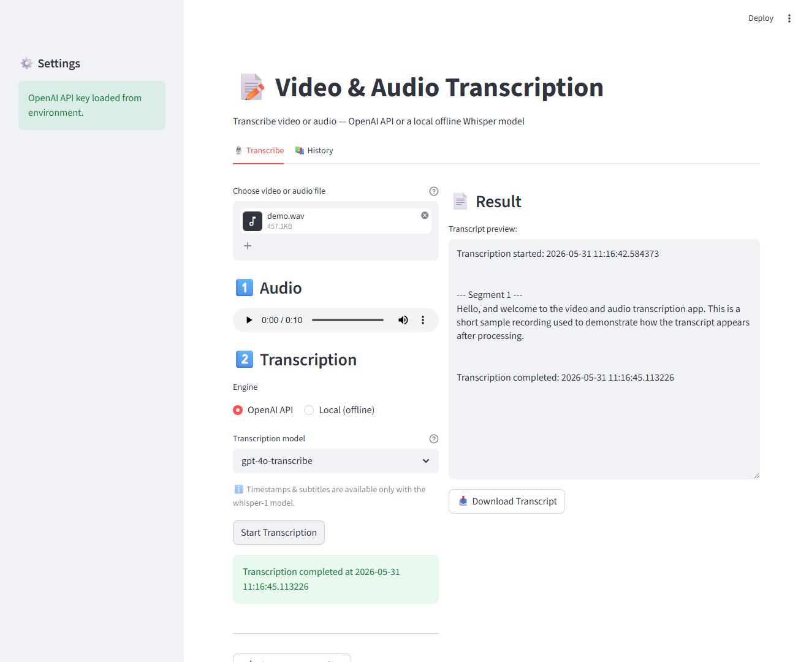
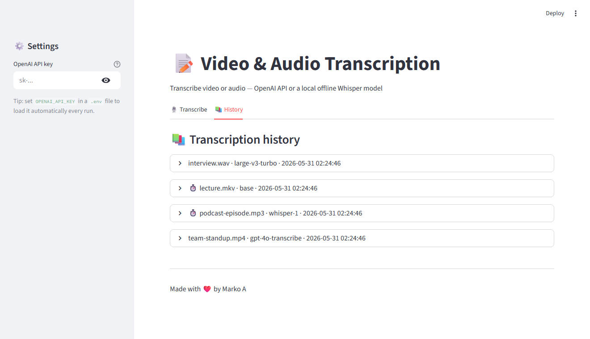

# VideoToText Transcription App 📝

[](https://github.com/marko2212/video-to-text/actions/workflows/ci.yml)

[](LICENSE)
[](https://github.com/astral-sh/ruff)

A Streamlit web app that transcribes speech to text — using either the **OpenAI audio API** or a **local, offline Whisper model** (`faster-whisper`). It accepts both video files (the audio track is extracted automatically) and audio files directly, and can export subtitles (`.srt`).

## Features ✨

* Upload **video** files in MKV, MP4, MOV, AVI, WebM, M4V, WMV, FLV, MPEG/MPG, 3GP, TS/MTS/M2TS, OGV, or VOB format.
* Upload **audio** files directly in MP3, WAV, M4A, AAC, FLAC, OGG, Opus, WMA, AIFF, or AMR format.
* **Automatic preparation:** audio from a video is extracted automatically on upload (no manual step); audio files are used as-is.
* **Built-in audio player** to listen to the uploaded/extracted audio before transcribing.
* **Two engines:** the **OpenAI API** (`gpt-4o-transcribe` / `whisper-1`) or a **local, offline Whisper** model (`faster-whisper`) that runs on your machine — free, private, no API key.
* **Pick the offline model size** in the UI (`tiny` … `large-v3-turbo`); it downloads on first use.
* **Readable transcripts** — inline `(M:SS)` time markers and automatic paragraph breaks instead of one wall of text.
* **On-screen context (video):** optionally pull the frames where the picture changed, have a vision model describe them, and merge those notes into the transcript by timestamp — so slides, diagrams and shared screens are captured, not just speech.
* **Optional timestamps & subtitle export** (`.srt`) — with `whisper-1` and with any local model.
* **Flexible API key:** read from `.env` if present, otherwise entered in the sidebar (kept only for the session).
* Handles large audio files by splitting them into smaller segments for transcription.
* Displays the transcription progress and a preview of the final transcript.
* Download the transcript as a TXT file (and subtitles as SRT).
* **Persistent history** of past transcriptions stored in a local SQLite database (survives the "Clean temporary files" action).
* Button to clean up temporary working files (`temp/`, `uploads/`).

## Screenshots 📸

**1. Upload & flexible API key** — drop in a video or audio file; the OpenAI key loads from `.env`, or type it into the sidebar (or skip it entirely and use the offline engine).



**2. Choose the engine, then transcribe** — OpenAI API (`gpt-4o-transcribe` / `whisper-1`) or a local, offline Whisper model, with the transcript shown right next to the controls.



**3. Persistent history** — browse, re-download (TXT/SRT), and delete past transcriptions.



## Requirements 🛠️

* **Python:** Version 3.12 or higher. (`uv` will fetch a matching interpreter automatically if you don't have one.)
* **uv:** Used to manage the virtual environment and dependencies. Install from [the uv docs](https://docs.astral.sh/uv/getting-started/installation/).
* **ffmpeg:** This external tool **must be installed and accessible** for the application to work. See installation instructions below. (**5.1 or newer** is recommended — older builds still work, but the on-screen context feature falls back to a deprecated flag.)
* **OpenAI API Key (optional):** only needed for the OpenAI engine. The local offline engine needs no key. You might incur costs depending on your OpenAI usage.
* **Python Packages:** Declared in `pyproject.toml` and locked in `uv.lock` — installed via `uv sync` (add `--extra local` for the offline backend).

## Installation ⚙️

1. **Clone or Download the Repository:**

    ```bash
    git clone https://github.com/marko2212/video-to-text.git # Or download the ZIP and extract
    cd video-to-text
    ```

2. **Install ffmpeg:** `ffmpeg` must be installed system-wide and accessible via your system's `PATH`.

    * **Windows:**
        1. Go to the official FFmpeg download page: [https://ffmpeg.org/download.html](https://ffmpeg.org/download.html)
        2. Navigate to the Windows builds section (often linked under "Windows EXE Files"). Recommended sources are `gyan.dev` or `BtbN`.
        3. Download one of the builds (e.g., the "essentials" build from gyan.dev is usually sufficient). It will likely be a `.zip` or `.7z` archive.
        4. Extract the downloaded archive. You'll get a folder (e.g., `ffmpeg-6.1.1-essentials_build`).
        5. Move this extracted folder to a permanent location, for example, `C:\ffmpeg`.
        6. **Add FFmpeg to PATH:**
            * Search for "Environment Variables" in the Windows Start Menu and select "Edit the system environment variables".
            * In the System Properties window, click the "Environment Variables..." button.
            * In the "System variables" section (or "User variables" if you prefer), find the `Path` variable, select it, and click "Edit...".
            * Click "New".
            * Enter the **full path to the `bin` folder** inside your ffmpeg directory (e.g., `C:\ffmpeg\bin`).
            * Click "OK" on all open windows to save the changes.
        7. **Verify:** Open a **new** Command Prompt or PowerShell window (important!) and type `ffmpeg -version`. If it shows version information, you're set.

    * **macOS (using Homebrew):**
        If you don't have Homebrew, install it first from [https://brew.sh/](https://brew.sh/). Then, open Terminal and run:

        ```bash
        brew install ffmpeg
        ```

        Homebrew will handle adding it to your PATH. Verify with `ffmpeg -version`.

    * **Linux (using package manager):**
        Open your terminal and use your distribution's package manager:
        * Debian/Ubuntu: `sudo apt update && sudo apt install ffmpeg`
        * Fedora: `sudo dnf install ffmpeg` (You might need to enable the RPM Fusion repository first if it's not found).
        * Arch Linux: `sudo pacman -S ffmpeg`

        Verify with `ffmpeg -version`.

3. **Install `uv`** (if you don't have it already):
    See the official [uv installation docs](https://docs.astral.sh/uv/getting-started/installation/). On Windows, the one-liner is:

    ```powershell
    powershell -ExecutionPolicy ByPass -c "irm https://astral.sh/uv/install.ps1 | iex"
    ```

    On macOS/Linux:

    ```bash
    curl -LsSf https://astral.sh/uv/install.sh | sh
    ```

4. **Install Python Dependencies:**
    A single command creates the virtual environment (`.venv/`), fetches a matching Python interpreter if needed, and installs every dependency from `uv.lock`:

    ```bash
    uv sync
    ```

    You do **not** need to manually create or activate a virtual environment — `uv run` (see below) handles that for you. Re-run `uv sync` any time `pyproject.toml` or `uv.lock` changes.

5. **Set up Environment Variables (optional):**
    * Only needed for the **OpenAI engine**. Copy `.env.example` to `.env` and set your `OPENAI_API_KEY`.
    * You can skip this and either paste the key into the app's sidebar at runtime, or use the **offline engine** (no key at all — see [Offline mode](#offline-mode-no-api-key-)).

## Running the Application 🚀

1. Run the Streamlit application from your terminal:

    ```bash
    uv run streamlit run app.py
    ```

    `uv run` automatically uses the project's `.venv` — no manual activation step needed.

2. Streamlit will provide local and network URLs (usually `http://localhost:8501` or similar). Open one of these URLs in your web browser.

### Quick launch 🖱️

**Windows** — run once to put an app icon on your Desktop:

```powershell
powershell -ExecutionPolicy Bypass -File scripts/create-shortcut.ps1
```

Then **double-click "Video & Audio Transcription"** on your Desktop — it starts the app (console minimized to the taskbar) and opens your browser automatically. You can also double-click `scripts\run.bat` directly.

**Linux / macOS** — run `bash scripts/run.sh` (or simply `make run`).

## Run with Docker 🐳

Prefer containers? Docker **bundles ffmpeg** and every dependency, so the host needs nothing but Docker itself. (Running without Docker still works — see above — but then **you must install ffmpeg yourself**.)

```bash
docker compose up --build
```

Open `http://localhost:8501`. Provide `OPENAI_API_KEY` via a `.env` file or your shell (or just type it into the sidebar). Transcription history (`data/`) and downloaded offline models (`models/`) persist via volumes.

To bake the **offline Whisper backend** into the image (bigger build):

```bash
INSTALL_LOCAL=true docker compose up --build
```

Docker is **optional** — it sits alongside the local `uv` / `make run` workflow; pick whichever you prefer.

## Usage 🖱️

Work in the **Transcribe** tab:

1. **Upload File:** Use the file uploader to select a video file (MKV, MP4, etc.) or an audio file (MP3, WAV, etc.). The audio is prepared automatically — a video's audio track is extracted on upload, and audio files are used directly. An audio player appears so you can listen first. (For video, you can also download the extracted `.wav`.)
2. **Pick the engine & options:** Choose the **engine** — **OpenAI API** (`gpt-4o-transcribe` / `whisper-1`) or **Local (offline)** (pick a model size that downloads on first use). Tick **"Include timestamps & generate subtitles (.srt)"** where available (`whisper-1` and any local model). For video, you can also tick **"Describe what's on screen"** (see [On-screen context](#on-screen-context-video-) below). For the OpenAI engine, set your key in `.env` or in the sidebar.
3. **Start Transcription:** Click "Start Transcription". Progress is shown while segments are processed (this may take several minutes for long audio).
4. **View & Download:** The transcript preview appears on the right with a "Download Transcript" button (and "Download Subtitles (.srt)" when timestamps were enabled).
5. **Clean Up:** "Clean temporary files" removes working files from `temp/` and `uploads/`. Your transcription **history is kept** (see below).

In the **History** tab you can browse, re-download (TXT/SRT), and delete past transcriptions. History is stored in a local SQLite database at `data/transcriptions.db`, so it persists across cleanups and restarts.

## On-screen context (video) 🖥️

Audio-only transcription misses whatever was *shown* rather than said. Tick **"Describe what's on screen"** when transcribing a video and the app extracts the frames where the picture actually changed, has a vision model describe them, and merges those notes into the transcript by timestamp:

```
🖥️ (0:05) A slide shows the title "Roadmap 2026" with the heading "Phase 1: migration".

(0:12) Moving on to what we have planned for next year.
```

This needs an **OpenAI API key** even when you transcribe with the local offline engine. Cost is bounded before you start: at most **40 frames per video** (about half a cent on the default model at `low` detail), and recordings where little changes on screen use far fewer. Pick **`high`** detail only when you need to read small text off a slide.

**"Screenshot at least every N seconds"** sets how often a frame is grabbed even when the picture has not changed — 5 to 300 seconds, 30 by default. Scene changes are always captured *in addition* to this, so a lower value mainly helps with slow fades and gradual changes that never look like a cut. Very short clips get a couple of extra samples so they are not represented by a single frame.

Frames that show nothing useful — a face, a blank desktop — are dropped automatically, and near-identical frames are deduplicated. Note that two slides differing only in a word or a number may be treated as duplicates, since the deduplication compares layout rather than text.

## Offline mode (no API key) 🔒

You can transcribe entirely on your machine with a local Whisper model — free, private, and offline. Install the optional backend once:

```bash
uv sync --extra local
```

Then in the app choose the **Local (offline)** engine and a model size (`base` is a good default). The model downloads from Hugging Face on first use into `models/` and is cached afterwards. Local transcription runs on the **CPU** by default; if you have a working CUDA setup, set `LOCAL_DEVICE=cuda` in `.env`.

## Configuration 🔑

* **OpenAI API Key (only for the OpenAI engine):** set it in the `.env` file as `OPENAI_API_KEY`, **or** type it into the sidebar at runtime (kept only for the session, never written to disk). The local offline engine needs no key.
* **Optional `.env` overrides:** `LOCAL_DEVICE` (`cpu`/`cuda`), `WHISPER_MODEL_DIR` (model cache location).

## Troubleshooting ⚠️

* **`ffmpeg not found` Error / Runtime Warning:** This is the most common issue. Double-check that `ffmpeg` is correctly installed using **one** of the methods described in the "Installation" section. If you installed it manually (Windows non-Conda), ensure the **correct `bin` folder** path is added to your system's PATH and **restart your terminal/VS Code** afterwards. Verify by running `ffmpeg -version` in a new terminal.
* **`openai.AuthenticationError`:** Double-check your API key in the `.env` file. Make sure the `.env` file is in the same directory where you run `streamlit run app.py`. Verify your OpenAI account status and billing information.

## Development 🧑‍💻

Common tasks are available as Makefile targets (run `make` for the full list):

* `make run` — start the app
* `make sync` — install dependencies from `uv.lock`
* `make test` — run the pytest suite
* `make check` — lint + format check + tests (the same gate as CI)
* `make lint` / `make format` — ruff

Continuous integration (`.github/workflows/ci.yml`) runs these checks on every push and pull request.

Project documentation — architecture, the reasoning behind each design decision, and a dated changelog — lives in [`docs/PROJECT.md`](docs/PROJECT.md).

## Author 👨‍💻

* Marko A

---
