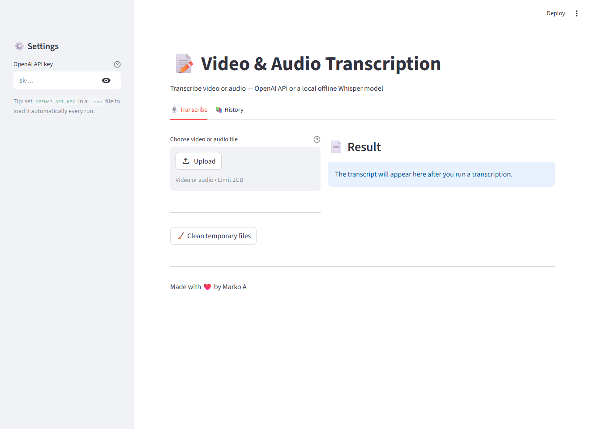
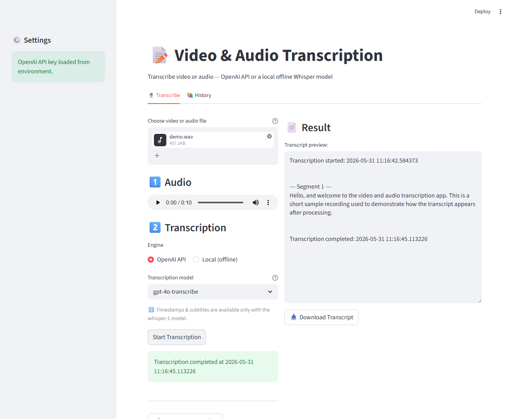
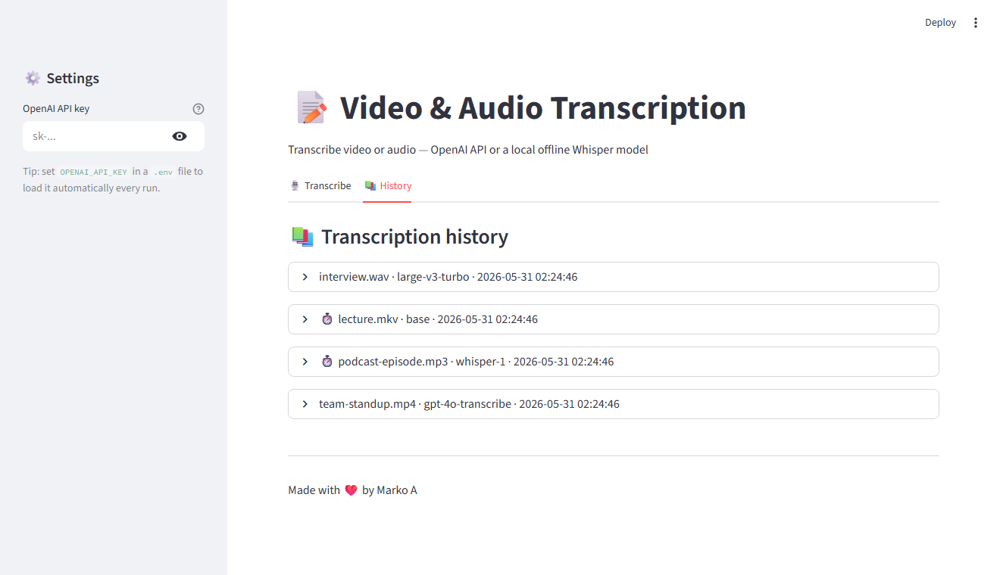

# VideoToText Transcription App 📝

[](https://github.com/marko2212/video-to-text/actions/workflows/ci.yml)

[](LICENSE)
[](https://github.com/astral-sh/ruff)

A Streamlit web app that transcribes speech to text — using either the **OpenAI audio API** or a **local, offline Whisper model** (`faster-whisper`). It accepts both video files (the audio track is extracted automatically) and audio files directly, and can export subtitles (`.srt`).

## Features ✨

* Upload **video** files in MKV, MP4, MOV, AVI, WebM, M4V, WMV, FLV, MPEG/MPG, 3GP, TS/MTS/M2TS, OGV, or VOB format.
* Upload **audio** files directly in MP3, WAV, M4A, AAC, FLAC, OGG, Opus, WMA, AIFF, or AMR format.
* **Or open them from a folder on this computer** — pick a recording from your recordings folder (OBS, Teams, a phone's folder), newest first. Nothing is uploaded or copied, so large recordings work even when memory is short (a browser upload holds the whole file in memory).
* **Automatic preparation:** audio from a video is extracted automatically on upload (no manual step); audio files are used as-is.
* **Built-in audio player** to listen to the uploaded/extracted audio before transcribing — including phone recordings (AMR) that browsers cannot play natively; videos and large files get a small MP3 preview so the page stays fast.
* **Two engines:** the **OpenAI API** (`gpt-4o-transcribe` / `whisper-1`) or a **local, offline Whisper** model (`faster-whisper`) that runs on your machine — free, private, no API key.
* **Pick the offline model size** in the UI (`tiny` … `large-v3-turbo`, all OpenAI's open-source Whisper); it downloads on first use.
* **Model hints in the dropdowns:** each OpenAI model shows its release year, what it is good at and its price per minute — `gpt-4o-transcribe` (2025) is the more accurate one and, billed per token, usually the cheaper (~$0.004/min measured on real meetings, against `whisper-1`'s fixed $0.006/min).
* **Readable transcripts** — time markers and automatic paragraph breaks instead of one wall of text: exact `(M:SS)` with `whisper-1` and the local engine, approximate `(~M:SS)` per paragraph with `gpt-4o-transcribe`.
* **On-screen context (video):** optionally pull the frames where the picture changed, have a vision model describe them, and place those notes in the transcript at their time — so slides, diagrams and shared screens are captured, not just speech.
* **AI title (optional):** after each run a chat model names the transcript from its content, in the transcript's own language and script, and History and downloaded files use that name — instead of the file name, or after it; older transcripts can be titled from History (see [AI title](#ai-title-)).
* **Optional timestamps & subtitle export** (`.srt`) — with `whisper-1` and with any local model.
* **Flexible API key:** read from `.env` if present, otherwise entered in the sidebar (kept only for the session).
* **Long recordings:** audio is sent in chunks of a few minutes, cut in pauses rather than mid-word, and short enough that the model never runs out of room to write (see [Configuration](#configuration-)).
* **Paid work is kept:** every finished chunk and screenshot description is saved on disk, so if a run stops — no credit, lost connection, the Stop button — pressing Start again sends only what is missing. A run that stops part-way shows what it has, clearly marked.
* **Clear errors:** a bad key or an empty OpenAI balance is reported in one sentence after one request, not retried and not shown as raw JSON.
* **Serbian in one script (optional):** `SERBIAN_LATIN=true` rewrites Serbian Cyrillic in Latin script, since the model can switch between chunks.
* Displays the transcription progress (with elapsed time) and a preview of the final transcript. The controls are locked while a run works, so a stray click cannot cancel it; History stays usable.
* Download the transcript as a TXT file (and subtitles as SRT).
* **Persistent history** of past transcriptions stored in a local SQLite database (survives the "Clean temporary files" action).
* Working copies (uploads, extracted audio) are deleted automatically after a day; a button cleans up all temporary working files (`temp/`, `uploads/`) at once.

## Screenshots 📸

**1. Upload & flexible API key** — drop in a video or audio file; the OpenAI key loads from `.env`, or type it into the sidebar (or skip it entirely and use the offline engine).



**2. Choose the engine, then transcribe** — OpenAI API (`gpt-4o-transcribe` / `whisper-1`) or a local, offline Whisper model, with the transcript shown right next to the controls.



**3. Persistent history** — browse, re-download (TXT/SRT), and delete past transcriptions.



## Requirements 🛠️

* **Python:** Version 3.12 or higher. (`uv` will fetch a matching interpreter automatically if you don't have one.)
* **uv:** Used to manage the virtual environment and dependencies. Install from [the uv docs](https://docs.astral.sh/uv/getting-started/installation/).
* **ffmpeg:** This external tool **must be installed and accessible** for the application to work. See installation instructions below. (**5.1 or newer** is recommended — older builds still work, but the on-screen context feature falls back to a deprecated flag.)
* **OpenAI API Key (optional):** only needed for the OpenAI engine. The local offline engine needs no key. You might incur costs depending on your OpenAI usage.
* **Python Packages:** Declared in `pyproject.toml` and locked in `uv.lock` — installed via `uv sync` (`uv sync --extra local` for the offline backend; see the note in [Offline mode](#offline-mode-no-api-key-)).

## Installation ⚙️

1. **Clone or Download the Repository:**

    ```bash
    git clone https://github.com/marko2212/video-to-text.git # Or download the ZIP and extract
    cd video-to-text
    ```

2. **Install ffmpeg:** `ffmpeg` must be installed system-wide and accessible via your system's `PATH`.

    * **Windows:**
        1. Go to the official FFmpeg download page: [https://ffmpeg.org/download.html](https://ffmpeg.org/download.html)
        2. Navigate to the Windows builds section (often linked under "Windows EXE Files"). Recommended sources are `gyan.dev` or `BtbN`.
        3. Download one of the builds (e.g., the "essentials" build from gyan.dev is usually sufficient). It will likely be a `.zip` or `.7z` archive.
        4. Extract the downloaded archive. You'll get a folder (e.g., `ffmpeg-6.1.1-essentials_build`).
        5. Move this extracted folder to a permanent location, for example, `C:\ffmpeg`.
        6. **Add FFmpeg to PATH:**
            * Search for "Environment Variables" in the Windows Start Menu and select "Edit the system environment variables".
            * In the System Properties window, click the "Environment Variables..." button.
            * In the "System variables" section (or "User variables" if you prefer), find the `Path` variable, select it, and click "Edit...".
            * Click "New".
            * Enter the **full path to the `bin` folder** inside your ffmpeg directory (e.g., `C:\ffmpeg\bin`).
            * Click "OK" on all open windows to save the changes.
        7. **Verify:** Open a **new** Command Prompt or PowerShell window (important!) and type `ffmpeg -version`. If it shows version information, you're set.

    * **macOS (using Homebrew):**
        If you don't have Homebrew, install it first from [https://brew.sh/](https://brew.sh/). Then, open Terminal and run:

        ```bash
        brew install ffmpeg
        ```

        Homebrew will handle adding it to your PATH. Verify with `ffmpeg -version`.

    * **Linux (using package manager):**
        Open your terminal and use your distribution's package manager:
        * Debian/Ubuntu: `sudo apt update && sudo apt install ffmpeg`
        * Fedora: `sudo dnf install ffmpeg` (You might need to enable the RPM Fusion repository first if it's not found).
        * Arch Linux: `sudo pacman -S ffmpeg`

        Verify with `ffmpeg -version`.

3. **Install `uv`** (if you don't have it already):
    See the official [uv installation docs](https://docs.astral.sh/uv/getting-started/installation/). On Windows, the one-liner is:

    ```powershell
    powershell -ExecutionPolicy ByPass -c "irm https://astral.sh/uv/install.ps1 | iex"
    ```

    On macOS/Linux:

    ```bash
    curl -LsSf https://astral.sh/uv/install.sh | sh
    ```

4. **Install Python Dependencies:**
    A single command creates the virtual environment (`.venv/`), fetches a matching Python interpreter if needed, and installs every dependency from `uv.lock`:

    ```bash
    uv sync
    ```

    You do **not** need to manually create or activate a virtual environment — `uv run` (see below) handles that for you. Re-run it any time `pyproject.toml` or `uv.lock` changes — with `--extra local` if you use the offline engine, or simply `make sync`, which keeps it.

5. **Set up Environment Variables (optional):**
    * Only needed for the **OpenAI engine**. Copy `.env.example` to `.env` and set your `OPENAI_API_KEY`.
    * You can skip this and either paste the key into the app's sidebar at runtime, or use the **offline engine** (no key at all — see [Offline mode](#offline-mode-no-api-key-)).

## Running the Application 🚀

1. Run the Streamlit application from your terminal:

    ```bash
    uv run streamlit run app.py
    ```

    `uv run` automatically uses the project's `.venv` — no manual activation step needed.

2. Open `http://localhost:8501` in your web browser.

    The app listens on **this machine only** (`.streamlit/config.toml`): transcripts are often confidential and the app has no login, so other devices on your network cannot reach it. To open it to your network on purpose — knowing that anyone who can reach the port can read and delete the whole history — start it with `uv run streamlit run app.py --server.address=0.0.0.0`. Streamlit's anonymous usage statistics are switched off in the same file.

### Quick launch 🖱️

**Windows** — run once to put an app icon on your Desktop:

```powershell
powershell -ExecutionPolicy Bypass -File scripts/create-shortcut.ps1
```

Then **double-click "Video & Audio Transcription"** on your Desktop — it starts the app (console minimized to the taskbar) and opens your browser automatically. You can also double-click `scripts\run.bat` directly.

**Linux / macOS** — run `bash scripts/run.sh` (or simply `make run`).

## Run with Docker 🐳

Prefer containers? Docker **bundles ffmpeg** and every dependency, so the host needs nothing but Docker itself. (Running without Docker still works — see above — but then **you must install ffmpeg yourself**.)

```bash
docker compose up --build
```

Open `http://localhost:8501`. The port is published on `127.0.0.1` only, for the same reason as above; change it to `"8501:8501"` in `docker-compose.yml` to expose it deliberately. Provide `OPENAI_API_KEY` via a `.env` file or your shell (or just type it into the sidebar). Transcription history (`data/`) and downloaded offline models (`models/`) persist via volumes.

To bake the **offline Whisper backend** into the image (bigger build):

```bash
INSTALL_LOCAL=true docker compose up --build
```

Docker is **optional** — it sits alongside the local `uv` / `make run` workflow; pick whichever you prefer. Two differences: only `OPENAI_API_KEY` is passed into the container (other `.env` settings are not), and `temp/` is not a volume, so saved parts of an unfinished run are lost when the container is recreated. *From a folder on this computer* is not offered there: the container listens on all interfaces, and the folder source is available only while the app listens on this machine alone.

## Usage 🖱️

Work in the **Transcribe** tab:

1. **Choose the file:** either **Upload a file** — a video (MKV, MP4, etc.) or an audio file (MP3, WAV, etc.) — or **From a folder on this computer**: press **📂 Browse…** to choose the recording in Windows' own *Open* window (it opens in the folder you used last, shows only video and audio files, and stays on top of the browser — click into it), or type or paste the full path of the folder, then pick a recording from the list (newest first, only video and audio files, subfolders not included). Pasting the path of a single recording also works — in Explorer, Shift + right-click it → *Copy as path* — and picks that file. Recordings can live in different folders: each Browse goes wherever the file is. The folder and the choice between the two are remembered. If the chosen recording changes on disk afterwards (it is still being recorded), the page says so and offers **↻ Load it again** rather than dropping the result it shows. The app's own working folders (`temp/`, `uploads/`) are not accepted. A file from the folder is read where it lies: nothing is uploaded or copied into `uploads/`, so use it for **large recordings** — a browser upload is held in memory while it arrives, and a big one can fail when memory runs short. The audio is prepared automatically — a video's audio track is extracted, and audio files are used directly. An audio player appears so you can listen first. (For video, you can also download the extracted `.wav`.)
2. **Pick the engine & options:** Choose the **engine** — **OpenAI API** (`gpt-4o-transcribe` / `whisper-1`) or **Local (offline)** (pick a model size that downloads on first use). Tick **"Include timestamps & generate subtitles (.srt)"** where available (`whisper-1` and any local model). For video, you can also tick **"Describe what's on screen"** (see [On-screen context](#on-screen-context-video-) below). For the OpenAI engine, set your key in `.env` or in the sidebar.
3. **Start Transcription:** Click "Start Transcription". Progress is shown part by part, with the elapsed time (this may take several minutes for long audio). The controls are locked until the run finishes, so a click cannot cancel it by accident; the History tab stays usable (an entry you open meanwhile fills in when the run ends). To cancel it, press **⏹ Stop** under Start (the toolbar's Stop does the same). The part already sent to OpenAI is paid for either way, so it is finished and kept: the page says "Stopping — waiting for the request in progress to finish…", and once that part is back — usually within a minute — the controls return with a note of how many parts are saved. **Start** then sends only the rest. A Local run stops within seconds; a video scan that is still running finishes first.
4. **View & Download:** The transcript preview appears on the right, showing **how long the run took** and **what it cost** — the tokens OpenAI reported for the transcription and the screenshots, priced at the rates in `config.py` (a `≈` marks an estimate, e.g. when an answer carried no usage) — with a "Download Transcript" button (and "Download Subtitles (.srt)" when timestamps were enabled). The same figure is saved with each history entry; OpenAI's own [Usage page](https://platform.openai.com/usage) stays the authority for billing.
    If an OpenAI run stops part-way (no credit left, no connection), you see the **partial transcript** instead, ending with a `⚠️` line that says where it stops and why; it is not saved to history. The finished parts are kept on disk, so **Start** again transcribes only the rest — the app says so under the button when it finds saved parts for your file.
5. **Clean Up:** working copies clear themselves: each time the page is opened, uploads stored in `uploads/` and the extracted audio (`.wav`) and player files (`.mp3`) in `temp/` that are more than a day old are deleted (never while a transcription is running). A page still showing such a file prepares it again from its source, and saved parts of an unfinished run are still used. Transcript files (`.txt`, `.srt`) in `temp/` are not touched for now. "Clean temporary files" removes all working files from `temp/` and `uploads/` at once, including saved parts of unfinished runs, and empties the uploader and the folder choice; recordings in your own folder are never touched. It is unavailable while a transcription is running — in any tab — so it can never delete a live run's saved parts. Those saved parts contain transcript text, so they are also deleted automatically after 14 days without use. Your transcription **history is kept** (see below).

In the **History** tab you can browse, re-download (TXT/SRT), and delete past transcriptions, each showing how long it took to produce and what it cost — listed under their AI title when that setting is on, with a button in each entry to make (or remake) its title. An entry's text is loaded only when you open it, so a long history does not slow the page down. History is stored in a local SQLite database at `data/transcriptions.db`, so it persists across cleanups and restarts. Entries recorded before this was added simply omit the timing.

## On-screen context (video) 🖥️

Audio-only transcription misses whatever was *shown* rather than said. Tick **"Describe what's on screen"** when transcribing a video and the app extracts the frames where the picture actually changed, has a vision model describe them, and places those notes in the transcript at their time:

```
🖥️ (0:05) A slide shows the title "Roadmap 2026" with the heading "Phase 1: migration".

(0:12) Moving on to what we have planned for next year.
```

With `whisper-1` or the local engine the speech has exact times, so each note lands exactly where it belongs. `gpt-4o-transcribe` returns no times, so its paragraphs are stamped `(~M:SS)` from where they sit in their chunk — assuming an even speaking rate — and a note goes before the first paragraph that starts after it. That is usually within a minute; use `whisper-1` or the local engine when it has to be exact.

This needs an **OpenAI API key** even when you transcribe with the local offline engine. If OpenAI refuses the key or the account has no credit, a local run goes ahead without the notes (with a warning), while an OpenAI run stops at once — its transcription would be refused the same way. Descriptions are saved as they arrive, so if the run stops, running it again does not pay for them twice; they are deleted once the run succeeds. Screenshots that could not be described are counted in a warning, not dropped silently. Cost is bounded before you start: at most **200 screenshots per video** — about 12 cents on the default model for Full HD video, whose frames cost about 2,500 input tokens each (measured; `low` and `high` detail cost the same on the gpt-5.4 models) — and recordings where little changes on screen use far fewer. Raise or lower that ceiling with `FRAME_MAX_COUNT` in `.env`.

**"Screenshot at least every N seconds"** sets how often a frame is grabbed even when the picture has not changed — 5 to 300 seconds, 30 by default. Scene changes are always captured *in addition* to this, so a lower value mainly helps with slow fades and gradual changes that never look like a cut. Very short clips get a couple of extra samples so they are not represented by a single frame.

When you tick the box, the app **scans the video once** — about a minute and a half per hour of video — and from then on shows, for every position of the slider, **exactly how many screenshots will be described** and what that costs. The run then describes exactly those frames. The number depends mostly on how many *different* screens the video shows: a static screen share may give a handful whatever the interval, a busy one many more.

If the interval you pick would give more screenshots than the limit — say every 5 seconds across a busy 17-minute screen share — the limit's worth are **spread evenly across the whole video** instead, so you still get coverage from start to finish, just at a coarser resolution. The app spells this out rather than quietly ignoring your choice:

> One every 5 s would give 204 screenshots, over the 200-screenshot limit, so **200** will be described, spread evenly over the video (about $0.12) — counted from a scan of this 17:00 video.

Frames that look alike share one image on disk during the scan; each screenshot that is described is still taken from the video at its own moment, so a note never describes an earlier screen.

Frames that show nothing useful — a face, a blank desktop — are dropped automatically, and near-identical frames are deduplicated. Note that two slides differing only in a word or a number may be treated as duplicates, since the deduplication compares layout rather than text.

## AI title 🏷️

Recordings often arrive with names like `Meeting in General-20260915_140312-Meeting Recording.mp4`. With **AI title** on, a chat model reads each finished transcript and names it in a few words, in the language the speakers use. The setting lives in the sidebar, is set once and kept across sessions (in the history database):

* **Off** (default) — nothing is sent; names stay as they were.
* **Replace the file name** — History and downloads use the title: `Database migration plan.txt`.
* **Add to the end of the file name** — `Meeting in General-20260915_140312-Meeting Recording - Database migration plan.txt`.

Pick the model next to it (`gpt-5.4-nano` by default, `gpt-5.4-mini` for a stronger one). A title costs about $0.004 per hour of recording on nano and about $0.014 on mini, and is counted in the run's cost. It uses your **OpenAI API key** after both engines, so with the setting on, a **Local** run's transcript is sent to OpenAI for its title. If the title cannot be made (no key, no credit, no connection), the transcript is still saved, without one, and a note says why.

The title is stored beside the original file name, never over it: switching the mode renames earlier titled transcripts too, the original name stays visible in the entry, and **Off** brings the old names back.

**The title keeps to the transcript's script.** The smallest model once gave an English meeting a Chinese title. So the app tells the model which script the transcript is written in (Latin, Cyrillic…), and a title in a script that is not a main one of the transcript (a tenth of its letters — a stray line of Chinese that Whisper sometimes invents in silence does not count) is sent back once to be written again; if the second answer is no better, the transcript is saved without a title and a note says why. A retry sends the transcript again, so it costs as much as the first try (both are counted).

**Older transcripts, or a title you do not like:** open the entry in **History** and press **🏷️ Make a title** (or **🏷️ New title**). It uses the model chosen in the sidebar, and its cost is added to that entry's cost (entries saved before costs were recorded show none). The button appears while the AI title setting is on.

## Offline mode (no API key) 🔒

You can transcribe entirely on your machine with a local Whisper model — free, private, and offline. Install the optional backend:

```bash
uv sync --extra local
```

(or `make sync-local`). **A later plain `uv sync` removes it again**, because `uv sync` installs exactly what it is asked for — add `--extra local` every time, or use `make sync`, which keeps the backend when it is installed. If the **Local (offline)** engine disappears from the app, this is why.

Then in the app choose the **Local (offline)** engine and a model size (`base` is a good default). The model downloads from Hugging Face on first use into `models/` and is cached afterwards. Local transcription runs on the **CPU** by default; if you have a working CUDA setup, set `LOCAL_DEVICE=cuda` in `.env`. The audio never leaves your machine; only [on-screen context](#on-screen-context-video-) and the [AI title](#ai-title-), when turned on, send screenshots or the transcript to OpenAI.

## Configuration 🔑

* **OpenAI API Key (for the OpenAI engine, on-screen context and the AI title):** set it in the `.env` file as `OPENAI_API_KEY`, **or** type it into the sidebar at runtime (kept only for the session, never written to disk). The local offline engine needs no key.
* **Optional `.env` overrides:**
    * `LOCAL_DEVICE` (`cpu`/`cuda`) and `WHISPER_MODEL_DIR` (model cache location) for the local engine.
    * `FRAME_MAX_COUNT` — screenshot ceiling for on-screen context (default 200).
    * `SEGMENT_DURATION_MINUTES` — chunk length sent to OpenAI, 1–15 minutes, for every model. By default it is **5 minutes for `gpt-4o-transcribe`**, whose answers stop at about 2,000 tokens — dense speech reaches that in well under 10 minutes, and the rest of the chunk used to be silently lost — and 10 for `whisper-1`. If an answer still comes back at that limit, the chunk is split once and both halves are transcribed again; a half that hits the limit again is kept and marked `⚠️` in the transcript. The price follows the audio length (per minute for `whisper-1`, audio tokens for `gpt-4o-transcribe`), so chunk length does not change it.
    * `SERBIAN_LATIN` — off by default, so transcripts keep the script the model returned (it may switch between Latin and Cyrillic from chunk to chunk). Set `true` to rewrite Serbian Cyrillic in Latin script; only text recognisable as Serbian (by letters such as ђ, ћ, џ, љ, њ, ј) is touched — but that includes Macedonian, which would come out in *Serbian* Latin, so leave it off if you transcribe Macedonian. Saved transcripts can be converted once with `uv run python scripts/serbian_latin_backfill.py` (reports what it would change) and then `--apply` (backs up the database first).
    * `ALLOW_LOCAL_FILES` — on by default: the page can list and read recordings from any folder of the computer it runs on. It is offered only while the app listens on this machine alone (`server.address` is `localhost`, as in `.streamlit/config.toml`); started with `--server.address=0.0.0.0` (and in Docker) only the uploader is offered. Set `false` to turn it off everywhere.

## Troubleshooting ⚠️

* **`ffmpeg not found` Error / Runtime Warning:** This is the most common issue. Double-check that `ffmpeg` is correctly installed using **one** of the methods described in the "Installation" section. If you installed it manually (Windows non-Conda), ensure the **correct `bin` folder** path is added to your system's PATH and **restart your terminal/VS Code** afterwards. Verify by running `ffmpeg -version` in a new terminal.
* **"OpenAI rejected the API key":** check `OPENAI_API_KEY` in `.env` (in the folder you start the app from) or the key in the sidebar.
* **"OpenAI credit exhausted":** the account has no prepaid balance left. Add credit at [platform.openai.com/settings/organization/billing](https://platform.openai.com/settings/organization/billing) — for the organization and project the key belongs to — or switch to the **Local (offline)** engine. A new balance can take a few minutes to reach the API.
* **"Stopped after part N of M":** see step 4 under Usage — press Start again and only the missing parts are sent.
* **A large upload fails** (the file turns red in the uploader; the terminal shows `MemoryError` and `Invalid multipart/form-data`): the computer ran short of memory while the browser sent the file — the app holds an upload in memory, briefly several times over. Choose **From a folder on this computer** instead, which reads the file from disk; or remove the previous file from the uploader (its ✕), close some browser tabs, and try again.
* **The Local (offline) engine is missing:** the backend is not installed (or a plain `uv sync` removed it) — run `make sync-local`.

## Development 🧑‍💻

Common tasks are available as Makefile targets (run `make` for the full list):

* `make run` — start the app
* `make sync` — install dependencies from `uv.lock`, keeping the offline engine if it is installed (`make sync-local` adds it)
* `make test` — run the pytest suite
* `make check` — lint + format check + tests (the same gate as CI)
* `make lint` / `make format` — ruff

Continuous integration (`.github/workflows/ci.yml`) runs these checks on every push and pull request.

Project documentation — architecture, the reasoning behind each design decision, and a dated changelog — lives in [`docs/PROJECT.md`](docs/PROJECT.md).

## Author 👨‍💻

* Marko A

---
